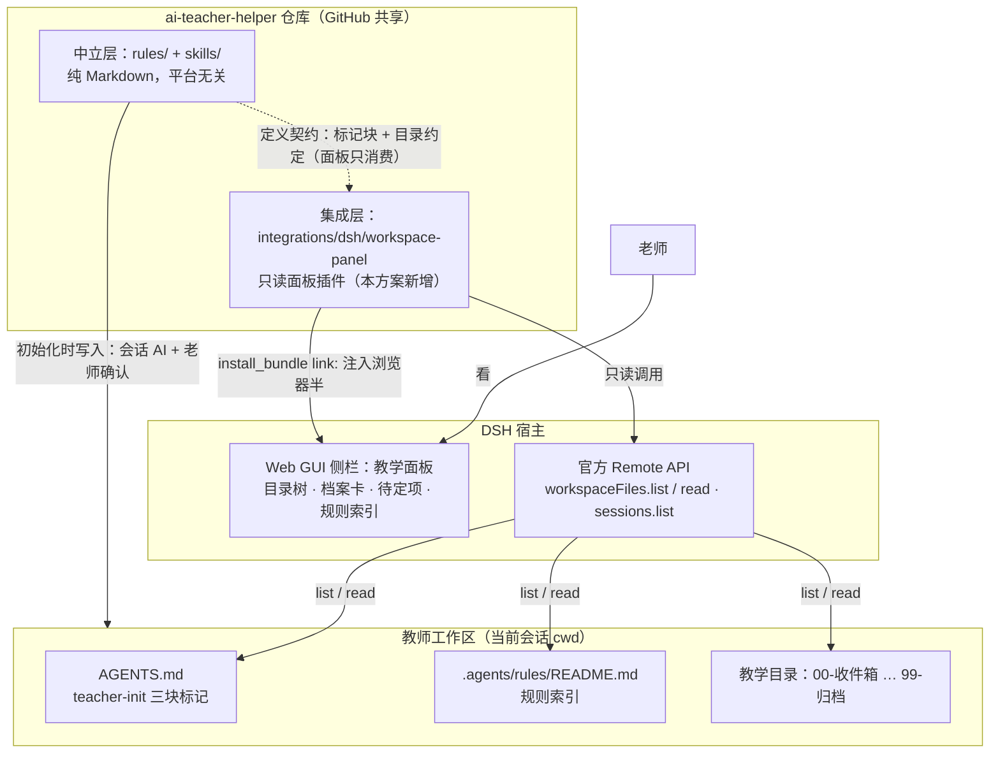
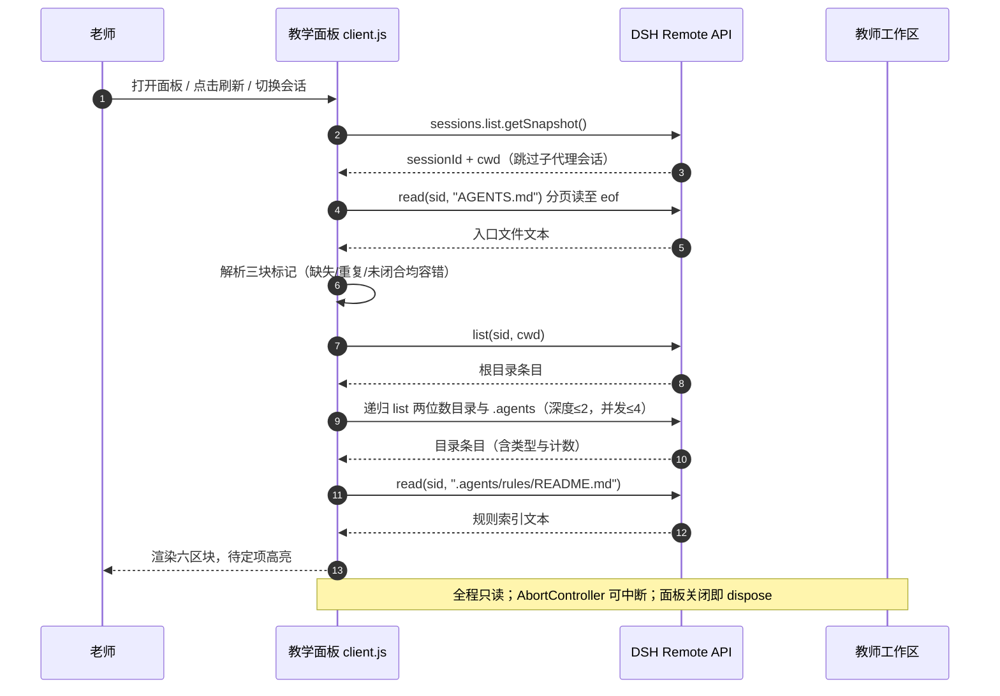

# 工作区面板插件设计方案（workspace-panel）

状态：初版已实现（v0.1.0），已通过 vm 端到端测试（真实工作区数据，23 项断言）
目标仓库：`ai-teacher-helper`（本仓库）
参考实现：`E:\teacher\dsh-extensions\plugins\skill-inspector`（已在本机 DSH 环境跑通）

---

## 1. 背景与定位

`ai-teacher-helper` 目前是纯 Markdown 的规则 + 技能仓库。真实使用（E:\测试老师项目demo 验证）暴露一个问题：**老师看到的全是 .md 文件**，工作区长什么样、哪些信息还没填，都要靠打开文件逐个看。

本设计在仓库内新增一个**可选的 DSH 面板插件**，把当前会话工作区的教学内容可视化：目录树、教师档案、待定项、规则索引、文件预览。

### 三条设计原则（先于一切）

| 原则 | 含义 |
|---|---|
| **可降级** | 没装面板（或不用 DSH）时，规则与技能照常工作。面板只是"看"的增强，永远不是"用"的依赖 |
| **只读** | 面板只读不写。一切对工作区的修改仍然通过会话里的 AI + 老师确认完成，面板不提供任何写入口 |
| **消费契约，不改契约** | 面板只解析 teacher-init 已经产出的标记块和目录约定；skills 侧不为面板做任何适配。这是"通用配套"能成立的前提 |

## 2. 仓库结构

```text
ai-teacher-helper/
├─ README.md                      ← 增加一段"可选面板"说明（实施时改，本文档不改）
├─ rules/                         ← 平台中立，不动
├─ skills/                        ← 平台中立，不动
├─ integrations/
│  └─ dsh/
│     └─ workspace-panel/         ← DSH 面板插件（独立 npm 包形态）
│        ├─ package.json          ← dsh manifest（bundle patch + client inject）
│        ├─ cordis.patch.yml      ← 一行 insert 注册
│        ├─ README.md             ← 面板的安装/使用说明（面向 DSH 用户）
│        └─ lib/
│           ├─ index.js           ← 宿主半：空 apply（照抄 skill-inspector 模式）
│           └─ client.js          ← 面板主体（单文件，含内联 CSS）
├─ docs/
│  └─ workspace-panel-design.md   ← 本文档
└─ .gitignore                     ← 新增：node_modules/、.dsh-debug/
```

**为什么不叫顶层 `panel/`**：`integrations/dsh/` 明确表达了"宿主绑定"。未来若出现其他宿主的可视化（如 Obsidian 视图），并列在 `integrations/` 下，不污染中立层。

**对"平台中立"承诺的影响**：根 README 现在写"不绑定任何平台"。实施时改为"核心（rules/skills）平台中立；`integrations/` 提供可选宿主增强，当前仅 DSH"。这是措辞收窄，不是立场推翻——不装 DSH 的用户完全无视该目录。

## 3. 面板信息架构

侧栏面板（`sidebar.panellist`，order 30 左右，标签"教学面板"），自上而下六个区块：

| # | 区块 | 数据来源 | 说明 |
|---|---|---|---|
| 1 | **工作区头** | `sessions.list` 当前会话的 `cwd` | 显示当前工作区路径；无会话时显示空态 |
| 2 | **初始化状态** | `AGENTS.md` 是否存在 + 标记块检查 | 已初始化 / 未初始化 / 标记异常（重复、未闭合），异常时给出具体描述 |
| 3 | **教师档案卡** | `AGENTS.md` 的 `profile` 块 | 逐行渲染"字段：值"；**值含"待定"的行高亮** |
| 4 | **待定项仪表盘** | profile 块 + persona/rules 块内含"待定"的行 | 集中列出，点击跳到档案卡对应行。这是对老师最有价值的一块——一眼看到"还差什么信息" |
| 5 | **教学目录树** | `workspaceFiles.list` 递归扫描 cwd | 两位数前缀目录（00-99）+ `.agents/`；每个目录显示文件计数；跳过空目录的折叠显示由 v0.1 简化为全展开 |
| 6 | **规则索引** | 读 `.agents/rules/README.md` 渲染其表格 | 每行"什么时候读"原样展示 |

**空态设计**：工作区没有 `AGENTS.md` 时，不报错，显示一段引导——"这个工作区还没有初始化。在会话里对助手说：用 teacher-init 初始化这个文件夹"。面板与技能在文案上互相指路，但零代码耦合。

**v0.2 增加**：文件预览——目录树点击文件 → 右侧抽屉用 `dsh-resource://file/session/<sid>/<path>` 读取渲染（md 按纯文本渲染 v0.2 不做 md 转 HTML，避免引依赖）。

## 4. 技术架构

### 4.0 总体架构图



三条设计原则在图上的落点：**可降级** = 拿掉 panel 节点，中立层与工作区之间的箭头（技能照常工作）不受影响；**只读** = panel 到工作区只有经过 API 的 list/read，没有任何写箭头；**消费契约不改契约** = 虚线，契约由中立层定义、面板单向消费。

### 4.1 已验证的 API 事实（全部来自 skill-inspector 跑通的代码，非猜测）

| 能力 | 调用 | 返回 |
|---|---|---|
| 列目录 | `ctx.remote.workspaceFiles.list(sessionId, path, signal)` | `{ok, value: {entries: [{name, type: "directory"\|"file", ...}]}}` |
| 读文本 | `ctx.remote.workspaceFiles.read(sessionId, path, {offset}, signal)` | `{ok, value: {text, offset, lines, eof}}`（分页，按 offset 翻页直到 eof） |
| 当前会话 | `ctx.sessions.list.getSnapshot()` → `ids`/`byId[id].cwd` | 跳过子代理会话（`origin === "subagent"`） |
| 注册面板 | `ctx.slots.inject("sidebar.panellist", function* () { yield ... })` | 注册 `{name: "main", key: PANEL_ID}` 组件 + 侧栏图标项 |
| 依赖注入 | `exports.inject = ["slots", "layout", "sessions", "remote", "remote.workspaceFiles", "sidebarRight"]` | 缺注入会在属性访问时抛受限错误 |

### 4.2 包形态（四个文件，零构建）

```jsonc
// package.json —— 照抄 skill-inspector 的 manifestVersion 1
{
  "name": "workspace-panel",
  "description": "教学面板：侧栏展示当前工作区的教学目录树、教师档案、待定项与规则索引（只读）",
  "version": "0.1.0",
  "private": true,
  "type": "module",
  "main": "lib/index.js",
  "exports": {
    ".": "./lib/index.js",
    "./client": "./lib/client.js",
    "./package.json": "./package.json"
  },
  "dsh": {
    "manifestVersion": 1,
    "bundle": { "patch": "./cordis.patch.yml" },
    "client": {
      "platform": "web",
      "inject": [
        "@deepseek-ai/dsh-api-remotes",
        "@deepseek-ai/dsh-api-session-controller",
        "@deepseek-ai/dsh-api-workspace-files",
        "@deepseek-ai/dsh-client-ui-sidebar-right"
      ]
    }
  }
}
```

```yaml
# cordis.patch.yml —— 一行注册，与 skill-inspector 同构
- insert:
    - id: ui-workspace-panel
      name: workspace-panel
```

```js
// lib/index.js —— 宿主半，空壳
function apply() {}
export { apply };
```

`lib/client.js` 是全部工作量所在：

- 入口：`window.__ModuleLoader__.load({ id: "workspace-panel", factory })`
- 渲染：`require("react")` + `require("react/jsx-runtime")`，用 skill-inspector 的 `el()` hyperscript 辅助函数（无 JSX、无打包器）
- CSS：字符串内联，`document.head` 注入 `<style data-plugin-css>`（照抄）
- 状态：小型 store（`set/subscribe/getSnapshot/dispose`，照抄 skill-inspector 的 `createSkillsStore` 骨架）
- 会话切换：订阅 `sessions.list`，会话变化 → 重扫；`connection/reset` → 重扫
- 刷新策略：**手动刷新按钮 + 面板打开时自动刷新**。v0.1 不做文件监听（client 端没有文件系统能力，这是硬限制，写进面板 UI 的说明里）

### 4.3 标记块解析器规格

```text
输入：AGENTS.md 全文（workspaceFiles.read 分页读取拼接）
提取：/<!--\s*teacher-init:(profile|persona|rules):begin\s*-->([\s\S]*?)<!--\s*teacher-init:\1:end\s*-->/
逐块产出：
  { kind: "profile"|"persona"|"rules", fields: [{key, value, pending: boolean}], raw }
容错规则（每条都有对应 UI 状态，不允许抛错崩溃）：
  1. 块缺失      → 该区块显示"未生成"，不阻塞其他块
  2. 块重复      → 状态 2"标记异常"，显示"第 N 处开始重复"，不渲染第二份
  3. begin 有 end 无 → 状态"标记未闭合"，显示原始文本兜底
  4. 字段行解析   → 只认 "- key：value"（全角冒号优先，兼容半角）；不认识的行进 raw 折叠区
  5. pending 判定 → value 含"待定"两字即为真（与 skills 侧的写入口径一致）
```

### 4.4 数据流（时序图）



刷新策略：**手动刷新按钮 + 面板打开时自动刷新**。v0.1 不做文件监听（client 端没有文件系统能力，这是硬限制，写进面板 UI 的说明里）。

**性能护栏**：v0.1 递归深度 2、每目录条目上限 50、并发 4；超限显示"已截断"。教学工作区规模（<200 目录）远低于护栏。

## 5. 与 skills/ 的契约

面板消费、不生产。契约清单（全部是 teacher-init 已有的既有约定，无一新增）：

| 契约 | 面板用法 |
|---|---|
| `<!-- teacher-init:profile:begin/end -->` 等三对标记块 | 解析档案/人设/边界 |
| 块内 `- 字段：值` 列表行 | 档案卡逐行渲染；"待定"高亮 |
| `.agents/rules/README.md` 的 `| 模块 | 内容 | 什么时候读 |` 表格 | 规则索引区块原样渲染 |
| 两位数前缀目录 = 教学区 | 目录树只展开这些目录 |

**兼容策略**：宽松解析。未来 teacher-init 若新增块类型（如 `archive`），面板遇到不认识的块 → 折叠显示原始文本，不报错。块格式若破坏性变更 → 面板版本号升 minor，同时兼容旧格式一个周期。

## 6. 分期与里程碑

| 里程碑 | 内容 | 验收标准 | 预估 |
|---|---|---|---|
| **M0 · 技术验证** | 克隆 skill-inspector 改名为 workspace-panel，跑通安装 + 面板出现在侧栏；用 list/read 打印 cwd 下条目到 console | DSH 面板栏出现"教学面板"图标；console 能看到 demo 工作区目录列表 | 0.5 天 |
| **M1 · v0.1 功能** | 六区块（无文件预览）+ 空态 + 解析器容错 | 对 E:\测试老师项目demo：档案卡待定高亮正确；目录树计数与实际一致；AGENTS.md 损坏时显示异常而非崩溃 | 1 天 |
| **M2 · v0.2 预览** | 目录树点文件 → 抽屉预览（分页读拼接） | 预览 SKILL.md / 规则模块 / README 三类文件内容完整（对照 read 工具输出） | 0.5 天 |
| **M3 · 文档与发布** | 面板 README、根 README 调整、.gitignore、提交推送 | 他人按 README 从克隆到面板可用 ≤10 分钟 | 0.5 天 |

每个里程碑独立提交，出问题可单独回退。

## 7. 安装、更新、分享流程（写进面板 README）

```text
首次安装（DSH 会话内让 Agent 执行）：
  plugin_manager install_bundle
  target: <仓库克隆路径>/integrations/dsh/workspace-panel 的绝对路径

启用：Plugins 页勾选 workspace-panel（或 plugin_manager set_bundle）
生效：刷新 Web 页面

更新代码后：plugin_manager set_plugin 将 workspace-panel 禁用再启用 → 刷新
换机器：clone 后必须重新 install_bundle（link: 指向绝对路径，不可移植）
```

**两个必须写进文档的坑**（都来自本机实测）：

1. **崩溃恢复会重置 bundle 列表**为 base+web-app——DSH 原生恢复机制会把 profile 的 bundles 重置，面板会"消失"。文档写明：重新去 Plugins 页勾选即可，插件文件未丢。
2. **面板跟随当前会话**：没有活动会话时显示空态；会话的工作区不是教学工作区（比如在 ai-teacher-helper 仓库本身里开会话）时，显示"当前工作区未初始化"空态，不误报。

## 8. Git 与版本设计

- `.gitignore` 新增（本次一并提供）：`node_modules/`、`.dsh-debug/`（现有未跟踪的调试脚本从此不再出现在 status 里）
- 插件版本 `0.x`：M1 = 0.1.0，M2 = 0.2.0；仓库打 git tag（`panel-v0.1.0`）对应
- 提交切分：① `.gitignore` + 本设计文档；② 插件四个文件；③ 根 README 调整。三个独立 commit，历史清晰
- 插件内不放仓库级信息（不放 ai-teacher-helper 的绝对路径假设），面板对任何教学工作区通用

## 9. 风险与对策

| 风险 | 对策 |
|---|---|
| `workspaceFiles.list` 递归行为与预期不符（如不返回目录类型） | M0 第一天实测 demo 工作区；不行就退化为"逐目录试探式 list"（对已知目录约定逐个 list，反正目录名是契约内的） |
| 会话 `cwd` 与教学工作区不一致（用户在别的目录开会话） | 空态文案明确"当前会话的工作区"，不做跨目录猜测 |
| 大工作区拖慢面板 | 深度/条目/并发三重护栏 + 截断提示 |
| DSH 升级改 API | inject 清单锁死；`typeof` 探测每个依赖，缺失时面板显示"宿主版本不兼容"而非崩溃 |
| 他人机器路径不同 | 面板只处理会话返回的 cwd，零路径假设；install 文档写明 link: 限制 |

## 10. 明确不做什么（v1 边界）

- 不做任何写操作（不建文件、不改 AGENTS.md）——写永远走会话 AI + 确认
- 不做 md 渲染成 HTML（预览用等宽纯文本，避免引 marked 等依赖）
- 不做文件监听自动刷新（client 端无文件系统能力，硬限制）
- 不做多工作区管理 / 历史会话切换（只跟当前会话）
- 不做非 DSH 宿主版本（其他宿主有需求时在 integrations/ 下另起目录）
